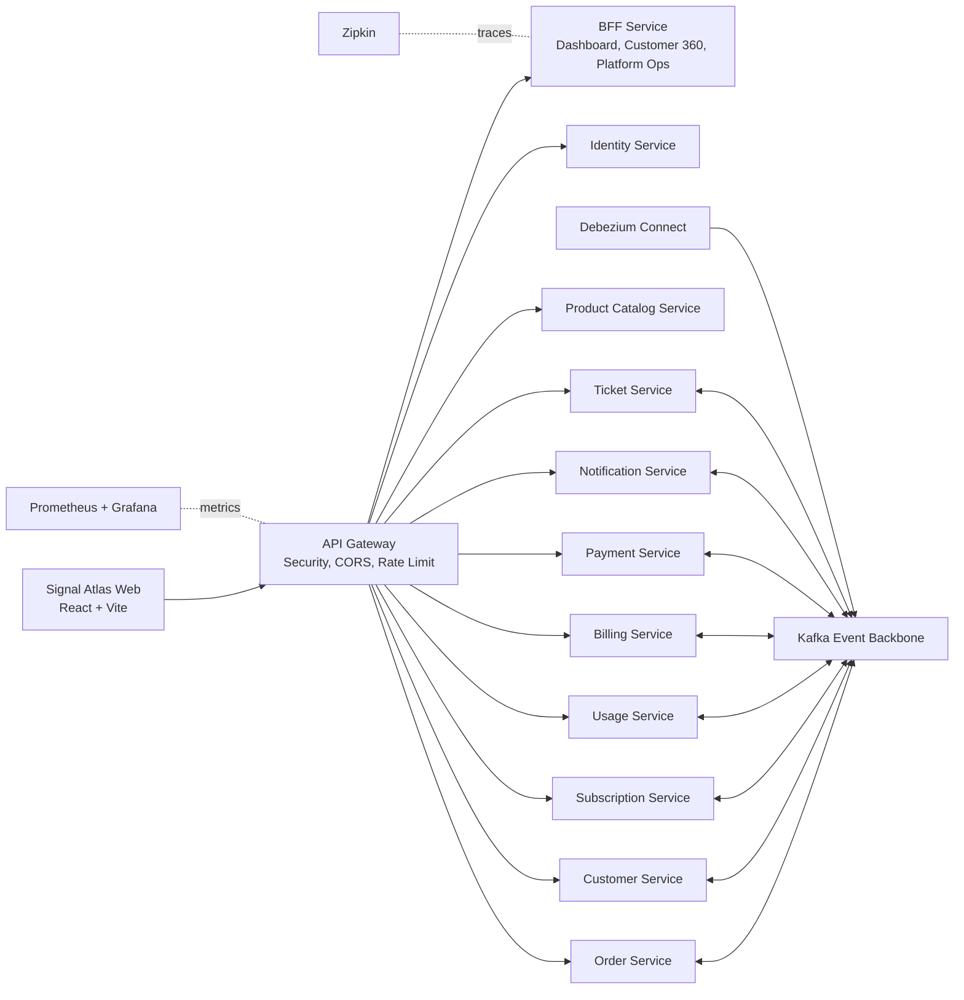
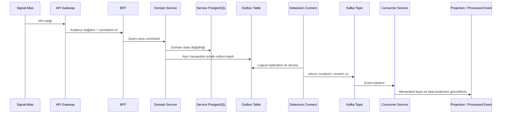
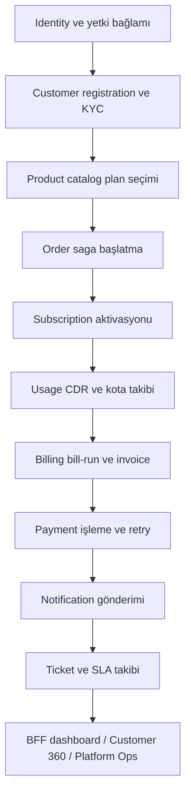
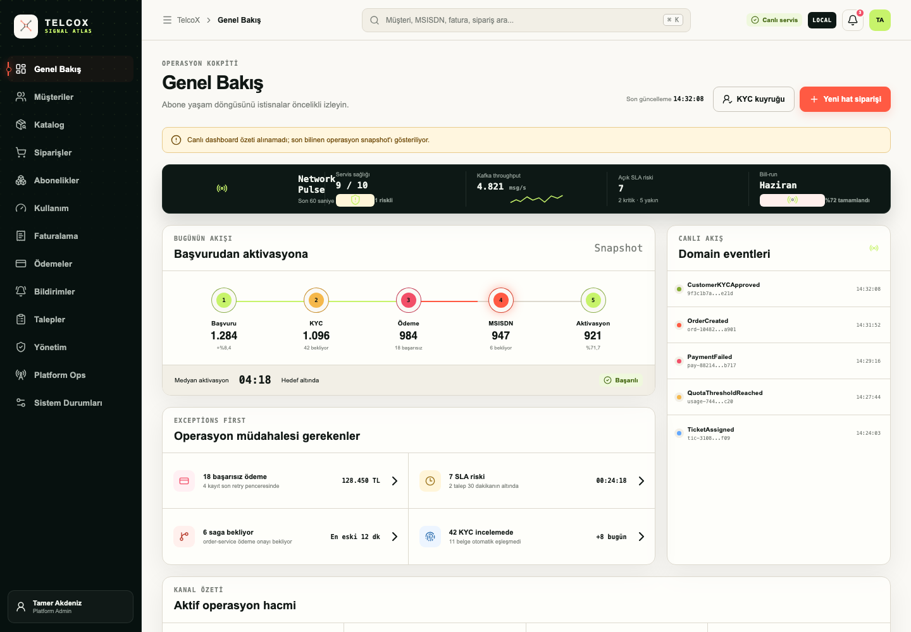
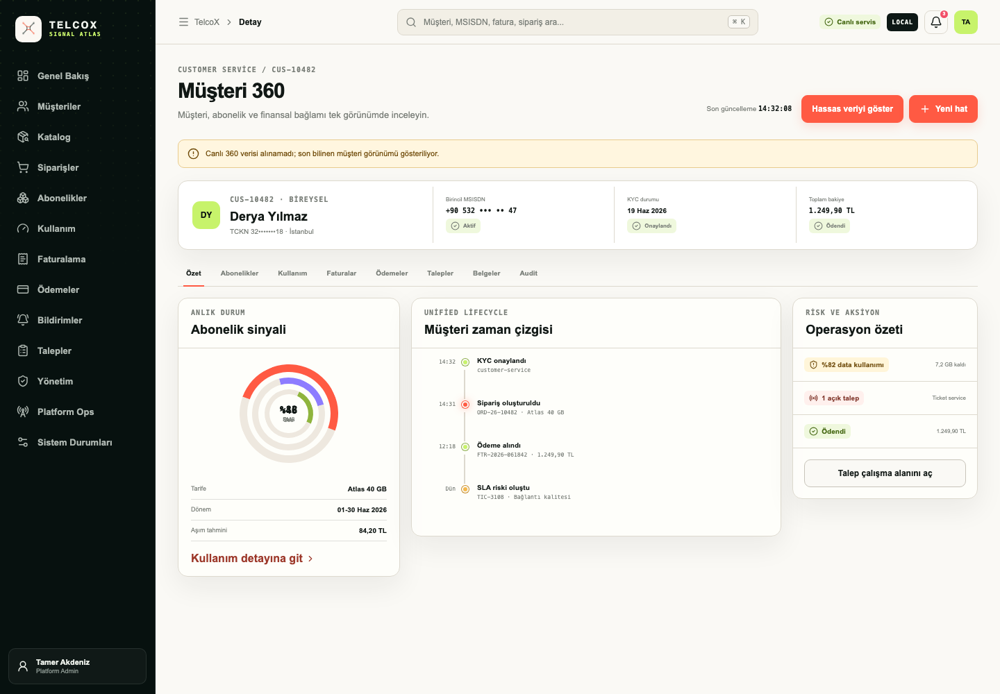
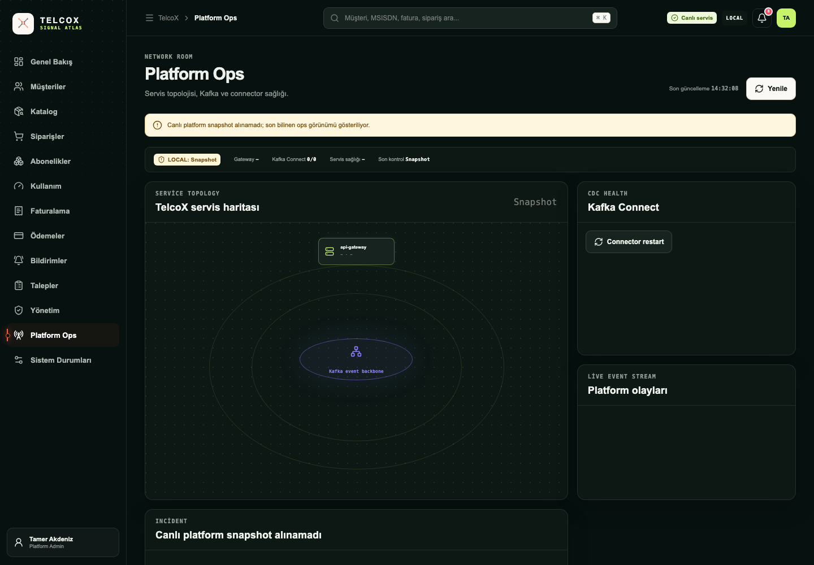
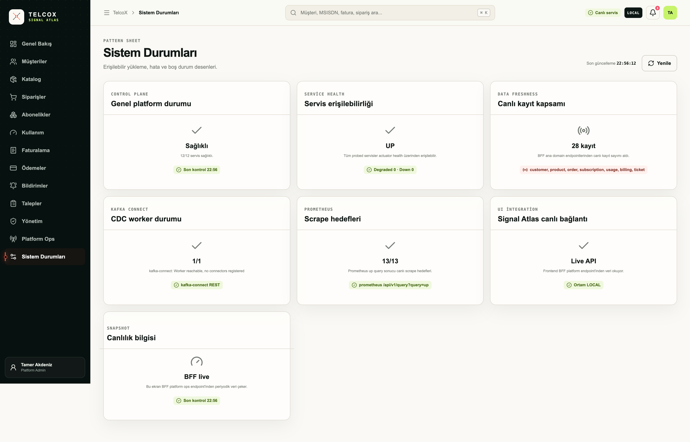

# TelcoX Signal Atlas

## Takım Üyeleri

| Üye | Sorumluluklar |
|---|---|
| Mustafa Tamer Akdeniz | PM, PO, Frontend, Backend, DevOps |
| Bahadır Sina Terzioğlu | Backend, DevOps, Test |
| Kevser Kahraman | Backend, Test, DB |
| Doğa Dedeakayoğulları | Backend, Test, DB |

## Proje Özeti

TelcoX Signal Atlas, telekomünikasyon şirketlerinin müşteri yaşam döngüsünü uçtan uca yönetmesi için geliştirilen mikroservis tabanlı bir CRM ve operasyon platformudur. Proje; müşteri/KYC, ürün kataloğu, sipariş saga süreci, abonelik, kullanım, faturalama, ödeme, bildirim, destek talepleri ve platform operasyonlarını tek bir mimari altında toplar.

Bitirme projesi kapsamında amaç, tek parça bir CRM uygulaması yerine ölçeklenebilir, izlenebilir ve test edilebilir bir mikroservis platformu tasarlamaktır. Her bounded context kendi veritabanına sahiptir; servisler arası tutarlılık API sözleşmeleri, Kafka eventleri, outbox/inbox yaklaşımı ve lokal projection tabloları ile sağlanır.

## Kapsam

| Alan | Açıklama |
|---|---|
| Müşteri yönetimi | Müşteri kaydı, KYC kararı, adres, iletişim, belge, izin, not ve audit kayıtları |
| Ürün kataloğu | Ürün, kategori, plan, fiyat, özellik ve aktif/pasif katalog yönetimi |
| Sipariş yönetimi | Yeni hat siparişi, iptal, customer/tariff snapshot ve saga geçmişi |
| Abonelik | Hat aktivasyonu, askıya alma, yeniden aktifleştirme, fesih, ek paket ve MNP süreçleri |
| Kullanım | CDR işleme, kota okuma, eşik aşımı ve overage event üretimi |
| Faturalama | Billing account, bill-run, invoice, invoice item, vergi ve PDF üretimi |
| Ödeme | Ödeme işleme, idempotency guard, retry policy ve retry schedule |
| Bildirim | Bildirim şablonları, gönderimler ve müşteri tercih projection'ı |
| Destek | Ticket oluşturma, listeleme, detay görüntüleme ve SLA atama |
| Operasyon arayüzü | React tabanlı Signal Atlas paneli, BFF aggregation ve platform ops görünümü |

## Teknolojiler

| Katman | Teknoloji |
|---|---|
| Backend | Java 21, Spring Boot 4.0.6, Spring Cloud 2025.1.1 |
| API | Spring Web/WebFlux, Spring Cloud Gateway, Springdoc OpenAPI |
| Frontend | React 19, TypeScript 6, Vite 8, Lucide React |
| Veri | PostgreSQL 16, Flyway, Spring Data JPA, Hibernate |
| Event ve mesajlaşma | Apache Kafka, Debezium Kafka Connect, transactional outbox |
| Cache ve idempotency | Redis 7 |
| Kimlik ve güvenlik | Spring Security, OAuth2 Resource Server, Keycloak JWT, gateway header relay |
| Resilience | Resilience4j, rate limit, timeout ve kontrollü upstream çağrıları |
| Gözlemlenebilirlik | Actuator, Micrometer, Prometheus, Grafana, OpenTelemetry, Zipkin |
| Test ve kalite | JUnit 5, Mockito, Testcontainers, JaCoCo, SonarCloud |
| DevOps | Docker Compose, Kubernetes/Kustomize, GitHub Actions, GHCR image publish |

## Mikroservis Mimarisi

## Mimari Katmanlar

| Katman | Rol |
|---|---|
| Sunum katmanı | `frontend/` altında Signal Atlas operasyon arayüzü bulunur. Kullanıcı; müşteri, sipariş, kullanım, fatura, ödeme, bildirim, ticket ve platform sağlığını tek panelden izler. |
| Gateway katmanı | `api-gateway` güvenlik, CORS, rate limit, correlation id, JWT doğrulama ve servis yönlendirme sorumluluğunu taşır. |
| BFF katmanı | `bff-service` frontend için dashboard summary, customer 360, onboarding operation status, SSE status stream ve platform ops verilerini birleştirir. |
| Domain servisleri | Her iş alanı kendi Spring Boot servisi, domain modeli, repository katmanı ve Flyway migration'ları ile ayrılmıştır. |
| Veri katmanı | Her servis ayrı PostgreSQL veritabanı kullanır. Servisler başka servislerin veritabanına doğrudan erişmez. |
| Event katmanı | Domain değişiklikleri outbox tablolarına yazılır; Debezium/Kafka ile topic'lere taşınır; consumer tarafında idempotent processing uygulanır. |
| Operasyon katmanı | Docker Compose, Kubernetes manifestleri, Prometheus, Grafana, Zipkin, Kafka UI, MailHog ve pgAdmin ile lokal/CI ortamı desteklenir. |

## Servis Haritası

| Servis | Sorumluluk | Veri Sahipliği |
|---|---|---|
| `api-gateway` | Dış trafik, güvenlik, route ve rate limit | DB yok |
| `bff-service` | Frontend aggregation, dashboard, customer 360, platform ops | Redis cache |
| `identity-service` | Kullanıcı profili, Keycloak adapter alanları, audit | `identity_db` |
| `customer-service` | Müşteri, KYC, iletişim, belge, izin, not, KVKK audit | `customer_db` |
| `product-catalog-service` | Ürün, kategori, plan, fiyat ve katalog versiyonları | `product_db` |
| `order-service` | Sipariş, saga geçmişi, customer/tariff projection | `order_db` |
| `subscription-service` | Abonelik yaşam döngüsü, ek paket, MNP | `subscription_db` |
| `usage-service` | CDR, kota, threshold ve overage eventleri | `usage_db` |
| `billing-service` | Billing account, invoice, bill-run, vergi, PDF | `billing_db` |
| `payment-service` | Ödeme, retry, idempotency ve ödeme durumu | `payment_db` |
| `notification-service` | Bildirim gönderimi, şablon ve tercih projection'ı | `notification_db` |
| `ticket-service` | Destek talebi ve SLA atama | `ticket_db` |

## DB ve Event Akışı

DB tasarımında temel kurallar şunlardır:

- Her mikroservis kendi PostgreSQL container ve schema yaşam döngüsünden sorumludur.
- Cross-service `FOREIGN KEY` kullanılmaz; servisler arası referanslar UUID/business key ile tutulur.
- Flyway migration'ları veritabanı şemasının tek kaynağıdır; Hibernate şemayı üretmek yerine doğrular.
- Outbox eventleri Debezium connector tanımlarıyla Kafka topic'lerine taşınır.
- Consumer tarafında `*_processed_event` tabloları ile aynı eventin tekrar işlenmesi engellenir.
- Projection tabloları sadece tüketici servisin ihtiyaç duyduğu minimum read-model alanlarını içerir.

## İş Akışı

## Signal Atlas Arayüzü

Frontend, `frontend/` altında React + TypeScript ile geliştirilmiş 18 ekranlık operasyon arayüzüdür. Demo veriyle gezilebilir; canlı backend entegrasyon sözleşmeleri `frontend/src/api.ts` ve `bff-service` endpointleri üzerinden hazırlanmıştır.

Ana ekranlar: Genel Bakış, Müşteriler, Müşteri 360, KYC, Katalog, Siparişler, Saga İzleyici, Abonelikler, Kullanım, Faturalama, Fatura Detayı, Ödemeler, Bildirimler, Talepler, Yönetim, Platform Ops ve Sistem Durumları.

## Linear Proje Takibi

Proje yönetimi bitirme projesi görev dağılımına uygun şekilde Linear üzerinden yürütülmüştür. Repository içinde gerçek Linear ekran görüntüsü dosyası bulunmadığı için README sahte veya kırık görsel içermez.

## Sonar Entegrasyonu

Sonar entegrasyonu `sonar-project.properties` ve GitHub Actions CI içinde tanımlıdır.

| Alan | Mevcut Durum |
|---|---|
| Proje anahtarı | `tamerakdeniz_telcox` |
| Organizasyon | `tamerakdeniz` |
| Kaynak analizi | `telco-common`, `telco-test-support`, `infrastructure`, `services`, `frontend/src` |
| Test analizi | Java test klasörleri ve frontend test pattern'leri |
| Coverage | JaCoCo XML raporları |
| CI davranışı | `SONAR_TOKEN` varsa Maven verify sonrası Sonar analizi çalışır; yoksa CI Sonar adımını bilinçli olarak atlar. |

## JUnit Testler

Projede 42 Java test sınıfı bulunmaktadır. Test kapsamı sadece controller seviyesinde kalmaz; domain davranışı, servis kuralları, idempotency, retry, projection, saga ve repository entegrasyonlarını da kapsar.

| Test Alanı | Örnek Kapsam |
|---|---|
| Unit test | Domain kuralları, servis davranışı, retry policy, idempotency guard |
| Controller test | Customer, Identity ve BFF/API endpoint davranışları |
| Integration test | Testcontainers ile PostgreSQL repository ve order saga akışları |
| Ortak test desteği | `telco-test-support` modülü ile tekrar kullanılabilir test altyapısı |
| Coverage | Maven lifecycle içinde JaCoCo raporu üretilir ve Sonar tarafından okunur |

## Zipkin, Prometheus ve Grafana

Tüm Spring Boot servislerinde Actuator, Prometheus metric endpointleri ve Zipkin tracing entegrasyonu yapılandırılmıştır.

| Bileşen | Rol | Lokal Yüzey |
|---|---|---|
| Zipkin | Servisler arası trace ve latency takibi | `http://localhost:19411` |
| Prometheus | Actuator metric scraping ve zaman serisi metrik toplama | `http://localhost:19090` |
| Grafana | Prometheus datasource ve TelcoX dashboard görselleştirmesi | `http://localhost:13000` |
| BFF Platform Ops | Servis sağlığı, Prometheus target durumu ve Kafka connector özetini frontend'e taşır | `/api/v1/bff/platform/ops` |

Prometheus konfigürasyonu `docker/observability/prometheus.yml` altında; Grafana dashboard ve datasource tanımları `docker/grafana/` altında tutulur. Trace tarafında `ZIPKIN_TRACING_ENDPOINT` ve `TRACING_SAMPLING_PROBABILITY` environment değerleri kullanılır.

## CI/CD ve Dağıtım

GitHub Actions pipeline'ı dört ana kalite kapısından oluşur:

| Job | Amaç |
|---|---|
| Maven verify | Tüm Java modüllerini derler, testleri çalıştırır ve JaCoCo raporu üretir. |
| Frontend build | `frontend` uygulamasını TypeScript ve Vite build sürecinden geçirir. |
| Kubernetes manifests | `k8s/local` Kustomize çıktısının render edilebilir olduğunu doğrular. |
| Docker images | Push eventlerinde servis image'larını GHCR altında yayınlar. |

Lokal orkestrasyon Docker Compose ile; Kubernetes hedefi ise `k8s/local` manifestleri ve `scripts/local-k8s-deploy.sh` üzerinden yönetilir.

## Başlıca Erişim Yüzeyleri

| Yüzey | Adres |
|---|---|
| Signal Atlas web | `http://localhost:15173` veya geliştirme ortamında `http://localhost:5173` |
| API Gateway | `http://localhost:18080` |
| Eureka Discovery | `http://localhost:18761` |
| Kafka UI | `http://localhost:18090` |
| Kafka Connect | `http://localhost:18084` |
| Zipkin | `http://localhost:19411` |
| Prometheus | `http://localhost:19090` |
| Grafana | `http://localhost:13000` |
| MailHog | `http://localhost:18025` |
| pgAdmin | `http://localhost:15050` |

## Dokümantasyon

| Dosya | İçerik |
|---|---|
| `docs/event-backbone.md` | Event envelope, topic standardı, retry/DLQ ve schema versioning |
| `docs/projection-standard.md` | Projection tablo, migration ve index isimlendirme standardı |
| `docs/idempotent-consumer-standard.md` | Event consumer idempotency yaklaşımı |
| `docs/identity-service-boundary.md` | Identity service sınırları ve sorumlulukları |
| `docs/features/payment-usage.md` | Payment ve usage özellik notları |
| `docs/adr/` | Mimari karar kayıtları |
| `k8s/local/README.md` | Lokal Kubernetes dağıtım notları |

## Son Durum

TelcoX Signal Atlas; mikroservis ayrımı, database-per-service yaklaşımı, event-driven veri yayılımı, BFF aggregation, React operasyon paneli, JUnit/Testcontainers testleri, Sonar kalite kapısı ve Zipkin/Prometheus/Grafana gözlemlenebilirliği ile bitirme projesi sunumuna uygun bütünlüklü bir platform halindedir.
